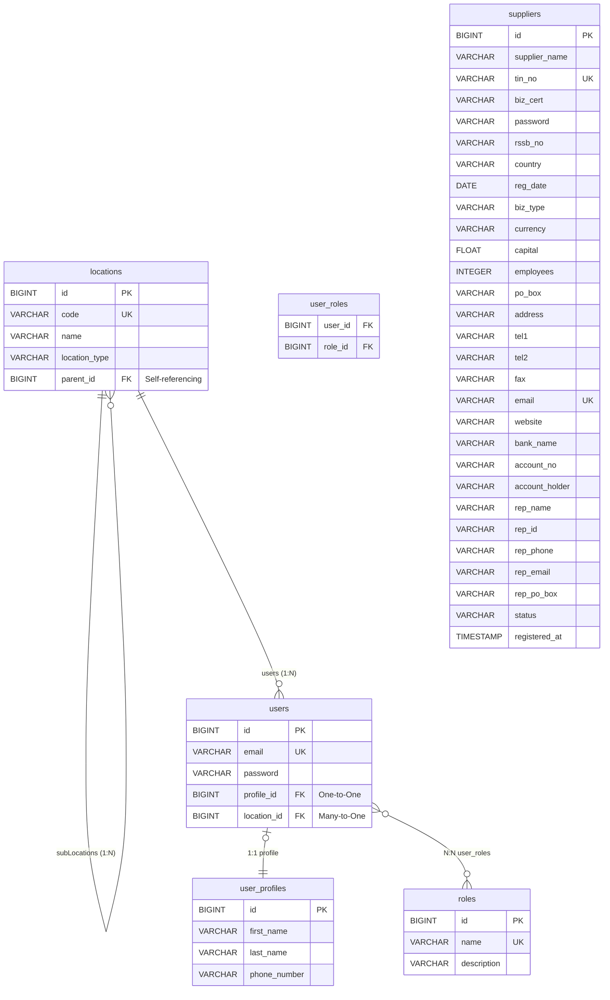

# E-Procurement Registration System - Entity Relationship Diagram (ERD)

This document contains the visual Entity Relationship Diagram and the logical mappings of the database tables required for the Midterm B Assessment.

## Entity Relationship Diagram

GitHub natively supports Mermaid diagrams. Below is the visual ERD representing the 5+ tables in the `eprocurement_db`.

---

## Logical Explanation of the Relationships (Assessment Criteria)

### 1. ERD with at least FIVE (5) tables (3 Marks)
The database contains 5 main operational tables: `users`, `user_profiles`, `locations`, `roles`, and `suppliers` (along with a join table `user_roles`).
The central operational object is the `User`. A `User` has a 1-to-1 relationship with `UserProfile` to isolate login credentials from personal details, an N-to-1 relationship with `Location` to track where they operate, and an N-to-N relationship with `Role` to manage diverse permissions. `Location` is self-referencing to accurately model geographical hierarchy (e.g., Province -> District). `Supplier` is a standalone entity encompassing comprehensive corporate details.

### 2. Implementation of saving Location (2 Marks)
When saving a Location, the data is stored in the `locations` table. The hierarchy constraint is preserved via a **self-referencing One-to-Many relationship**. A location can specify a `parent_id` linking it to another row within the same `locations` table, allowing infinite recursive sub-divisions of regions.

### 3. Implementation of Sorting and Pagination (5 Marks)
Pagination and sorting rely on Spring Data JPA’s `Pageable` and `PageRequest` constructs. Pagination improves scale and memory utilization by applying SQL `LIMIT` and `OFFSET` clauses underneath, returning only a specific slice (page) of data instead of loading large tables into memory. Sorting injects dynamic `ORDER BY` clauses based on incoming API properties.

### 4. Implementation of Many-to-Many relationship (3 Marks)
The Many-to-Many relationship is mapped between the `User` and `Role` entities. Because a user might carry multiple roles simultaneously, and a role spans across multiple users, Relational Algebra demands a **join table** to resolve this cardinality. This is established using `@JoinTable(name = "user_roles")` on the `User` entity to manage surrogate pairs of `user_id` and `role_id` foreign keys.

### 5. Implementation of One-to-Many relationship (2 Marks)
This constraint governs the `Location` structure. One single parent `Location` is responsible for Many `subLocations` recursively (e.g., One Province has Many Districts). This architecture is annotated with `@OneToMany(mappedBy = "parent")` on the children list, matched to a `@ManyToOne` annotation on the single parent reference, utilizing one `parent_id` foreign key.

### 6. Implementation of One-to-One relationship (2 Marks)
The `User` and `UserProfile` entities maintain a strict bijection separating authentication concerns from broad personal context. This behaves using the `@OneToOne` annotation mapping. The `users` table establishes a `profile_id` foreign key linking to the exact `id` of the matching `user_profiles` row to achieve isolated tight coupling.

### 7. Implementation of existBy() method (2 Marks)
Implemented explicitly within `LocationRepository` (`existsByCode`) and `UserRepository` (`existsByEmail`). Spring Data leverages the method signature terminology to compile an optimized, underlying `EXISTS` SQL clause. This terminates table scans instantly upon the first matching row evaluation, delivering significantly reduced execution time over traditional entity-mapping queries like `findBy`.

### 8. Retrieve all users from a given province (4 Marks)
Implemented via `UserRepository.findUsersByProvinceOrAnyLocationCode()`, deploying a custom JPQL `@Query`. Given that a User may register explicitly at bottom-level segments (e.g., Village), the algorithm uses nested `LEFT JOIN` iterations scaling up the `parent_id` mapping hierarchy. This allows matching conditional parameters spanning up to 4 layers deep along parent ancestors seamlessly.

